# Ingredient Search Flowchart

## Complete Search Flow

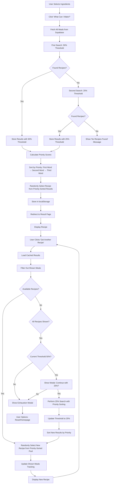

## Detailed Component Flow

### 1. Initial Search Process with Priority Sorting

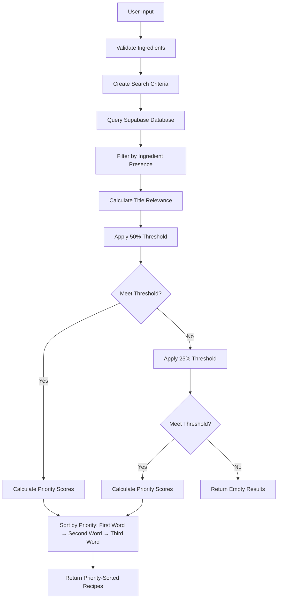

### 2. Priority Calculation Process

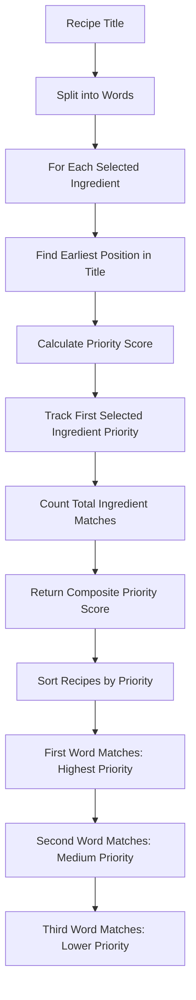

### 3. Caching System with Priority Preservation

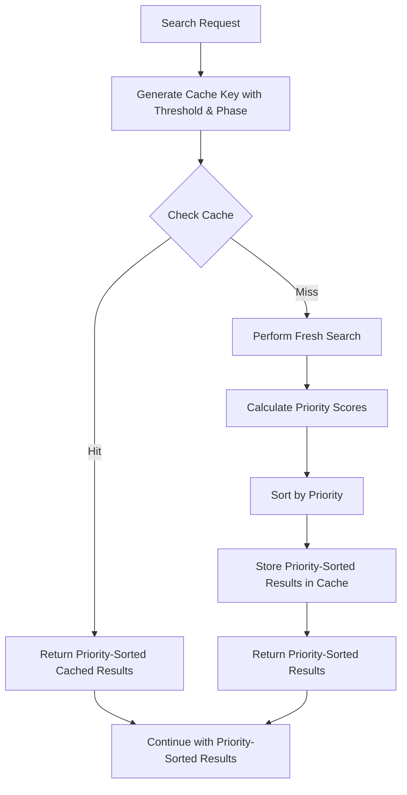

### 4. Recipe Navigation Flow with Priority

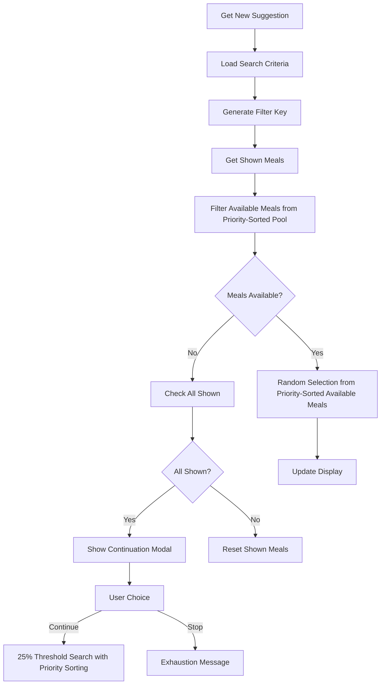

## State Management Flow

### LocalStorage Structure with Priority

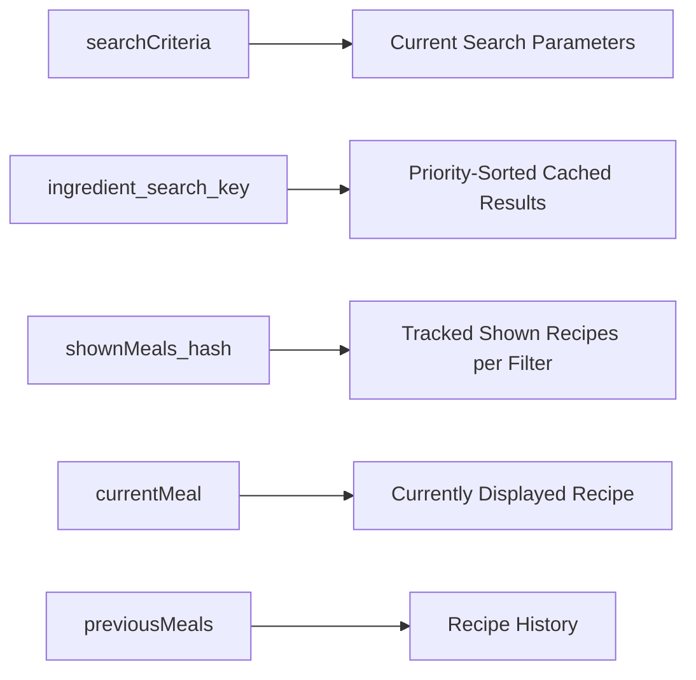

### Search Phases with Priority

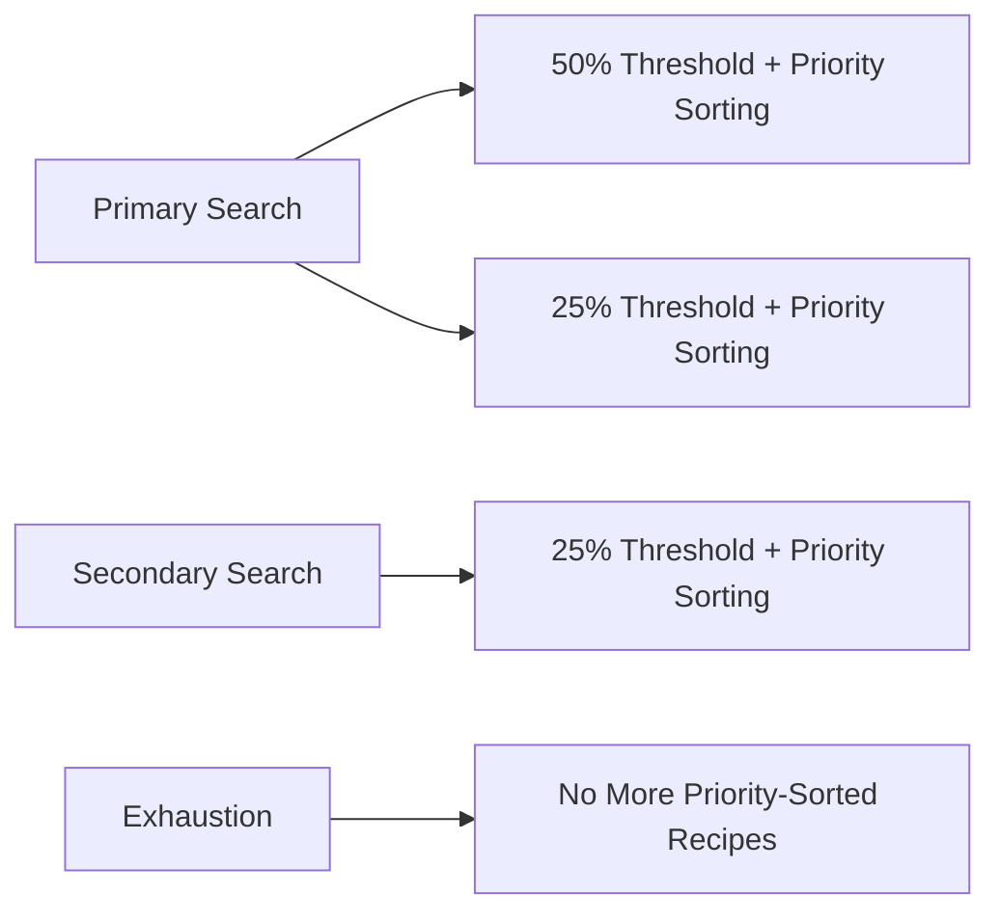

## Error Handling Flow

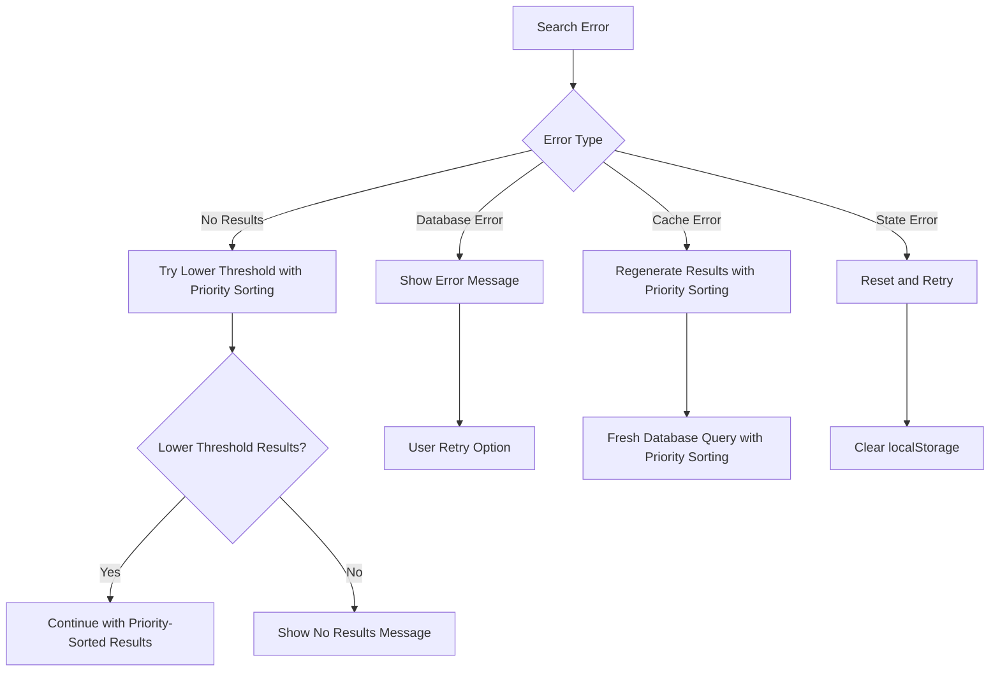

## Performance Optimization Flow

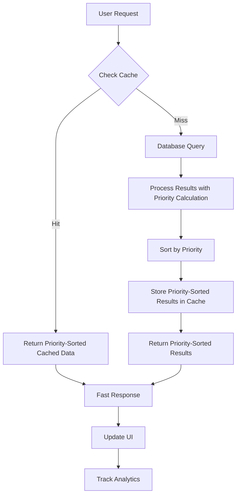

## Key Decision Points

### Priority-Based Threshold Selection Logic

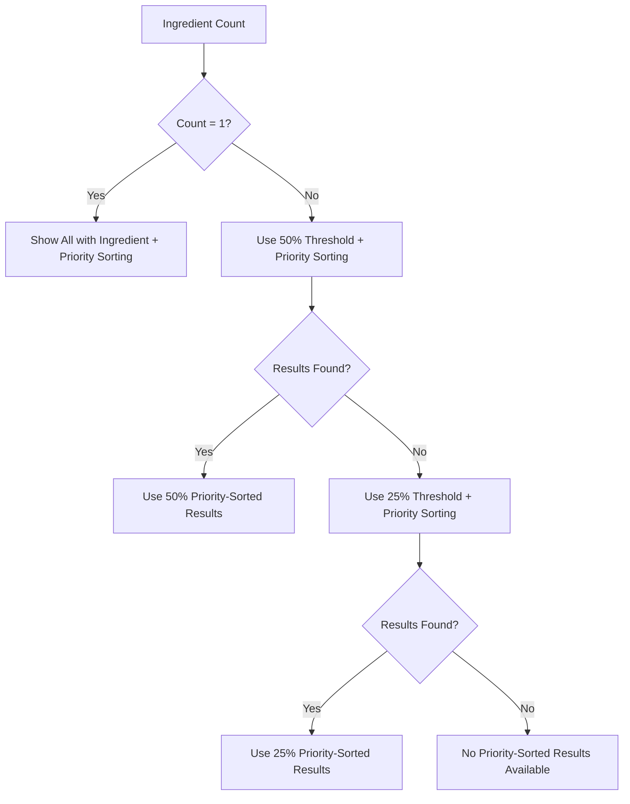

### Priority-Based Continuation Logic

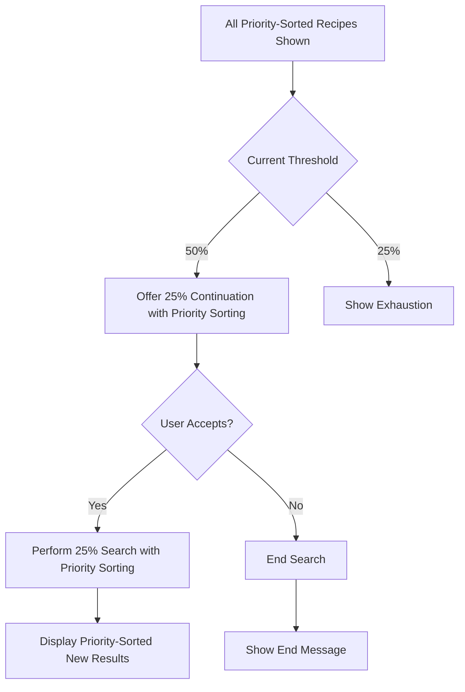

## Priority System Visualization

### Priority Score Calculation

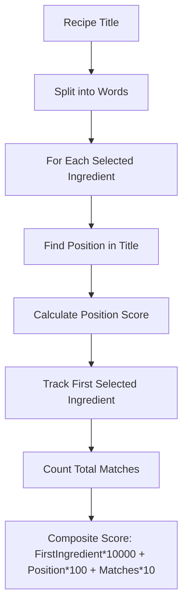

### Priority Sorting Example

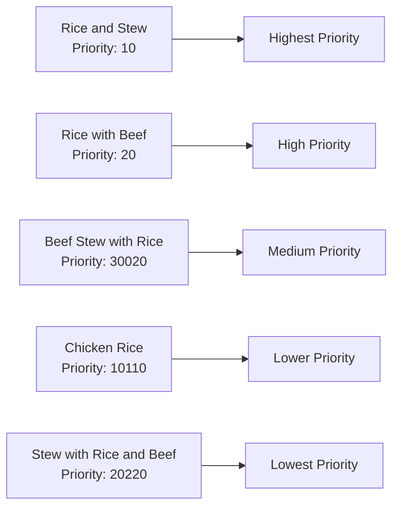

This flowchart documentation provides a visual representation of how the ingredient search system works with the new priority-based sorting feature, making it easier to understand the complex logic flow and decision points in the system. 