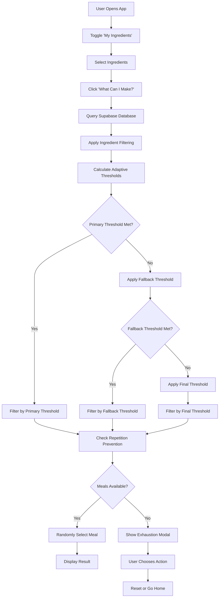
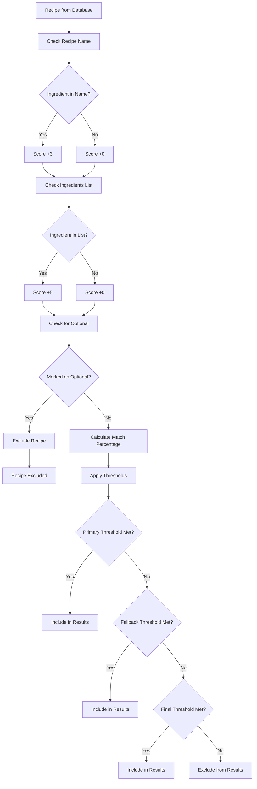
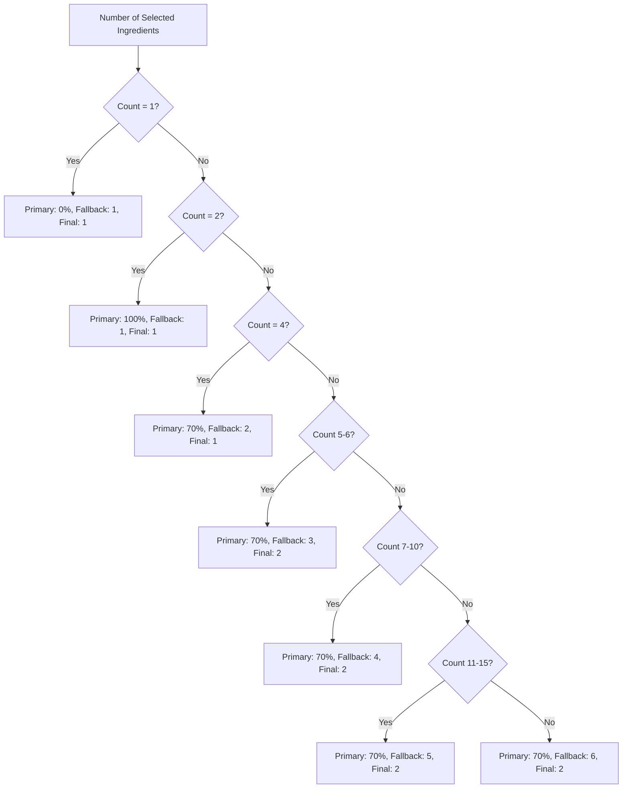
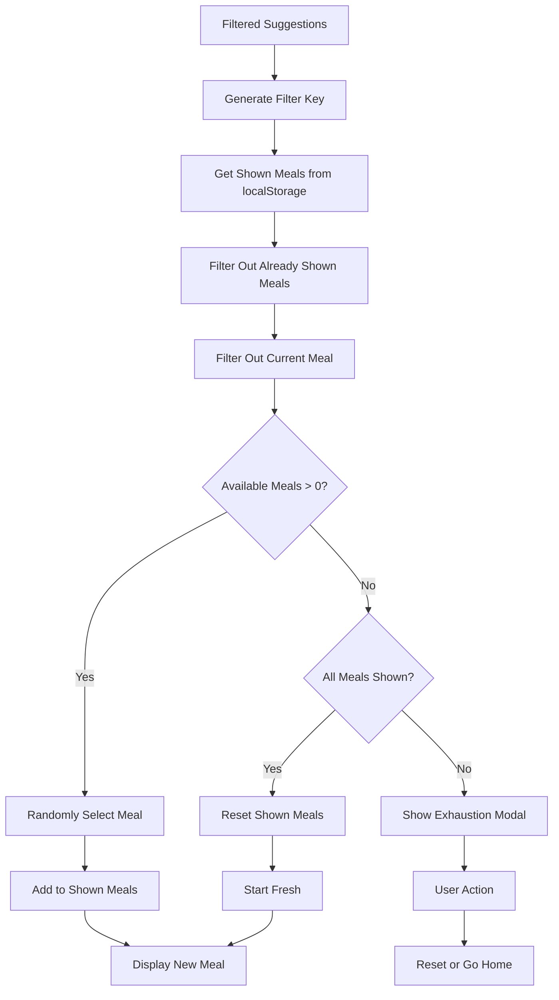
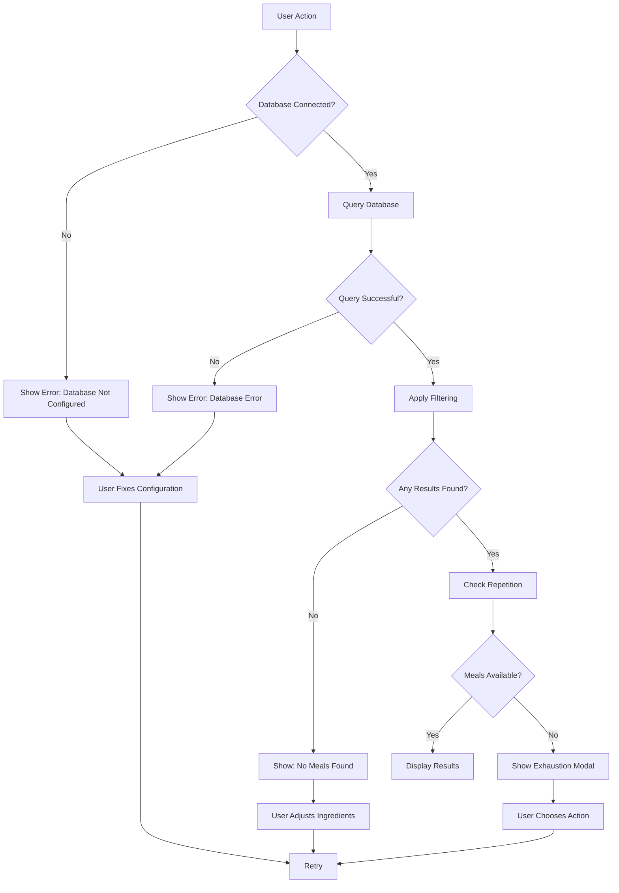

# 🔄 Ingredient Search Flowchart

## Process Overview

## Detailed Filtering Process

## Adaptive Threshold Logic

## Repetition Prevention System

## Error Handling Flow

## Data Flow Architecture

```mermaid
flowchart LR
    A[User Interface] --> B[React State]
    B --> C[LocalStorage]
    C --> D[Supabase Database]
    D --> E[Filtering Engine]
    E --> F[Threshold Calculator]
    F --> G[Repetition Prevention]
    G --> H[Result Display]
    H --> I[User Feedback]
    I --> J[Analytics Tracking]
```

## Key Decision Points

### 1. **Ingredient Mode Toggle**
- **Condition**: `showIngredientMode === true`
- **Effect**: Bypasses meal type and cooking time filters
- **Behavior**: Only filters by selected ingredients

### 2. **Threshold Application**
- **Primary**: Try exact percentage match
- **Fallback**: Try minimum ingredient count
- **Final**: Use most lenient criteria

### 3. **Repetition Prevention**
- **Current Meal**: Always excluded from next suggestion
- **Shown Meals**: Tracked per filter combination
- **Reset**: When all meals shown for current filter

### 4. **Exhaustion Handling**
- **Condition**: No meals available after all filters
- **Options**: Reset shown meals or return to homepage
- **User Choice**: Determines next action

## Performance Optimization Points

1. **Database Query**: Limited to 50 meals maximum
2. **String Matching**: Case-insensitive for consistency
3. **Caching**: localStorage for shown meals tracking
4. **Lazy Loading**: Only process when needed
5. **Error Boundaries**: Graceful degradation on failures

---

**Visual Documentation**: This flowchart complements the detailed technical documentation and provides a clear visual representation of the ingredient search process flow. 